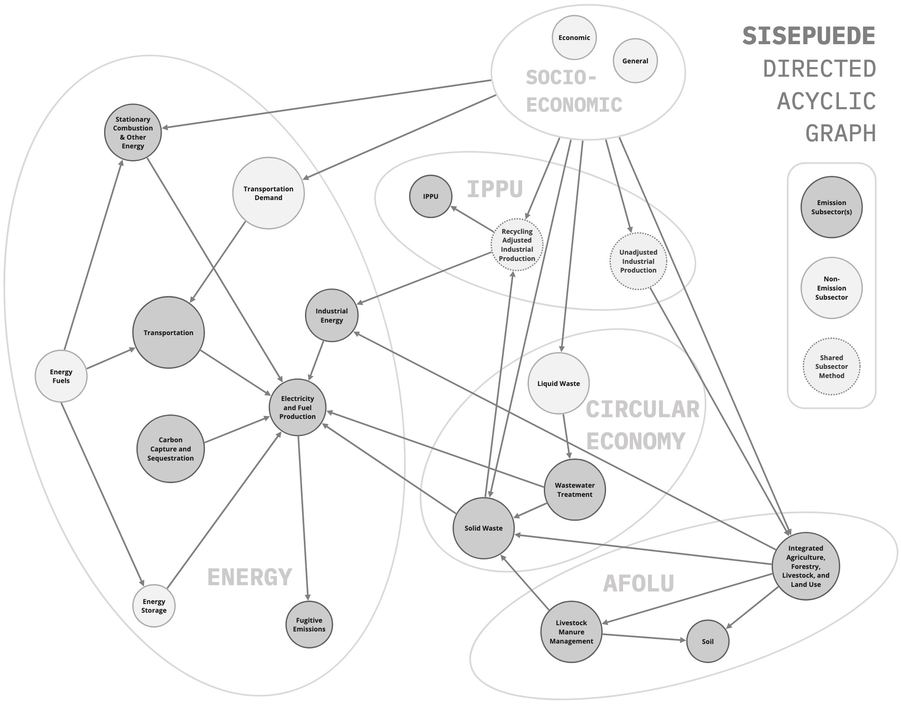

=========================
SISEPUEDE - Model Concept
=========================

SISEPUEDE Directed Acyclic Graph (DAG)
======================================

SISEPUEDE model integration is best reflect in a directed acylic graph, also known as a DAG.

Known Issues
------------
* Demand for harvested wood products in AFOLU is based off industrial demands that are not adjusted for recycling. SISEPUEDE 2.0 will fix this.

Integrated Modeling Framework (IMF)
===================================

Test
